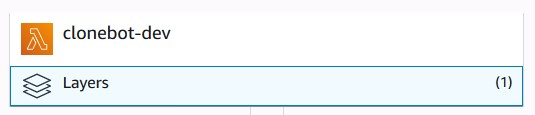
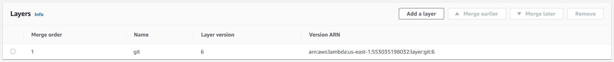
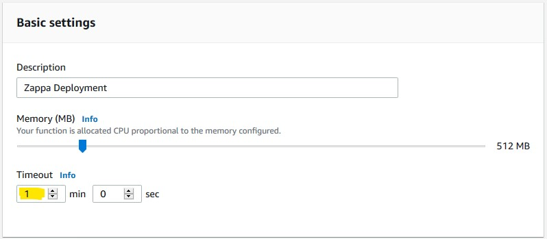

# CloneBot

CloneBot uses the Slack events api to listen for any links to "github.com".
This requires an HTTP server to receive the events.
We can easliy port this to AWS lambda such that the incoming events trigger a function.

# Zappa
Zappa is a python tool that eases the deployment of a Flask Style app to AWS lambda.

# Setup
1. Setup virtualenv
    - `virtualenv -p python3 --prompt "(zappa) ".venv`
    - `pip install -r requirements.txt`
1. Ensure you have an AWS user set up with administrator access
    - Zappa will create a limited user to own the lamda functions
1. Install awscli and use the administrators "Access Key ID"
1. `zappa init`
    - Set whatever "stage name" you want
    - This will allow zappa to create an s3 bucket to drop the lambda function into
    - Default settings should be fine for most things
1. Add the required environment variables to the `zappa_settings.json` file
```
{
    "aws_environment_variables": {
        "SLACK_SIGNING_SECRET": "...",  # found on the app's "Basic Information Page"
        "TEST_TOKEN": "...",  # "Bot User OAuth Access Token" on the app's "Install App" page
    }

}
```
1. `zappa deploy <stage_name>`
    - This should fail, the lambda will be missing the SSH layer
1. Add the SSH layer to the lambda
    - `arn:aws:lambda:<region>:553035198032:layer:git:6`
    - replace region with your region from above (eg. us-east-1)


1. Adjust the timeout for the lambda to at least 60s
    - Every `zappa update` this will need to be done again


# Links
* [Slack App Management](https://api.slack.com/apps)
* [Slack Events API](https://api.slack.com/events-api)
* [Zappa Github](https://github.com/Miserlou/Zappa)
* [AWS Lambda Git Layer](https://github.com/lambci/git-lambda-layer)
